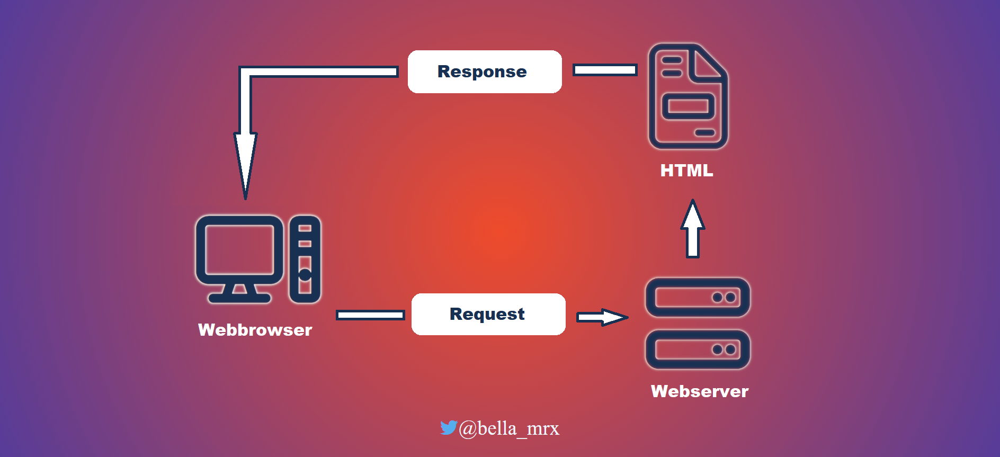
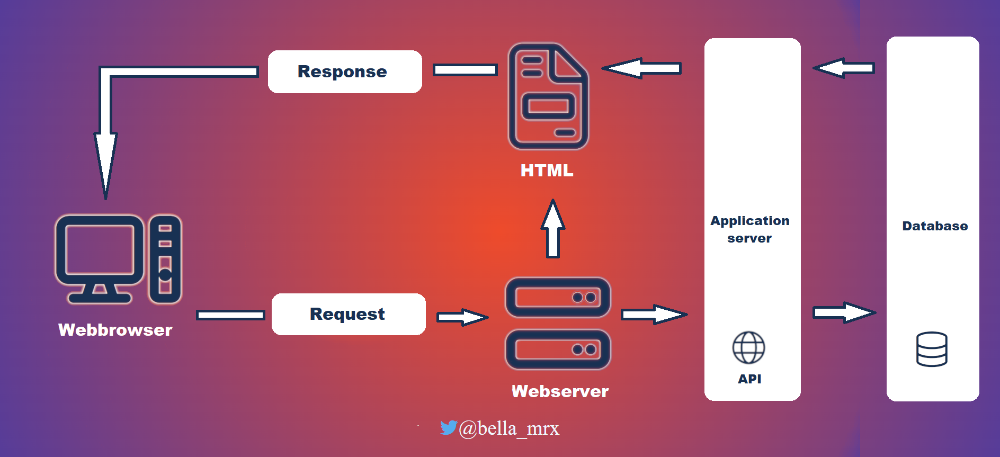

# HTML-and-CSS_Tutorial

 detailed tutorial about HTML and CSS + templates (all basics for HTML and CSS)

---------------------------------------------------------------------------------------------------------------

## Contents
1. Introduction to HTML
2. Structure of a HTML document

---------------------------------------------------------------------------------------------------------------

## 1. Introduction to HTML

### 1.1. HTML
  - HTML (Hypertext Markup Language) is a text-based markup language for structuring electronic documents such as text with hyperlinks, images and other content. HTML documents are the basis of the World Wide Web and are displayed by web browsers. In addition to the content displayed by the browser, HTML files can contain additional details in the form of meta information, e.g. about the languages used in the text, the author or the summarized content of the text --> [W3C](https://www.w3.org/)

### 1.2. Different types of websites
  * **Web presence (Homepage / Corporate Website)**
    - can be a private homepage or a web presence of companies, associations, authorities or business persons
    - for companies, municipalities and non-profit organizations it is often called a corporate website
    - many small companies and private persons use ready-made systems such as *WordPress* (Content-Management-System)

  * **Blog / online magazine / portfolio**
    - a website with usually chronologically sorted entries, which are separated from each other
    - can also be the start page of a website to display the latest articles or current information
    - online magazines can also be structured in this way
    - many companies and private persons often use ready-made systems like e.g., *WordPress* or *Drupal*
    - there are different blog types e.g. *corporate blog* (official company blog), *microblogging* (Twitter)
    - the installation of a blog software (e.g. *WordPress*) is flexible, because the blog can be extended with many templates and modules
    - portfolio websites are well suited for designers, photographers, artists and creatives, often website themes with minimalistic design
    - Knowledge of PHP and MySQL is an advantage but not necessary when using e.g. [Blogger](https://www.blogger.com) or [tumblr](https://www.tumblr.com) 

  * **E-commerce websites**	
    - in practice, one uses ready-made software, since the effort is less to update or maintain production catalog, and more importantly are much more secure especially with payment transactions
    - with ready-made software, an online store can be set up quite quickly, but there is a long list of legal requirements that must be observed (imprint obligation, terms and conditions, cancellation policy, information on delivery times and prices, etc.)
    - depending on the range of functions, an online store can be expensive, from complete solutions offered by hosting providers to professional webshop software to be installed on a server or webspace
    - frequently used software: Shopify, Magento, WooCommerce or Shopware

  * **Landing page / Microsite**
    - usually consists of only one web page, e.g. to start a test phase for a product
    - the goal is to present all the elements of the product to the visitors of the website, so that they become potential customers
    - such pages are highly optimized for search engines

  * **Web platform - social networks**
    - functionality is often provided by a content management system, typical social network platforms are e.g. Facebook, MySpace or so-called Wiki software
    - in the commercial area a better customer oriented support can be achieved
    - basic idea is that the content of registered users is extended with pictures, texts or graphics etc. to offer a collection of information, as the content is created by the users a moderation is necessary to check and manage the content

  * **Web apps**
    - these are Internet applications with many interaction possibilities, such as a common desktop application
    - such applications do not necessarily have to run in a web browser
    - Advantages can be an improved use and also a faster Perfomance

### 1.3. Dynamic and static websites

  * **Static websites**
    - the complete content such as texts, image data is stored unchanged in individual files on the web server
    - the content of such a file is created with HTML
    - in case of changes, the files usually have to be changed manually on the local computer and then uploaded to the webserver again
    - worthwhile for smaller web presences, where changes are rarely necessary 

  * Advantages:
    - costs are lower because no special features (databases, scripting languages) are needed
    - page load and load time may be faster, because page can be returned immediately from the web server as an response to the request
    - Development can be easier and cheaper, but it depends on the size of the project and the knowledge of the user

  * Disadvantages:
    - good knowledge of HTML and co. necessary to update website
    - creation of many single files for static website can be very time consuming

 

 This is a simplified representation of how a static web page is returned. The web browser first sends a request for a web page to the web server that hosts the web page. The web server finds the page and sends it back to the web server as a response. If it is not found, an error message is returned (status code 404).

  * **Dynamic websites**
    - usually a CMS (Content-Management-System) generates the web pages.
    - content like text and images are usually kept separate from the technical elements like layout or scripting
    - a CMS must be installed in a web server environment to be able to use previously installed script languages like PHP or Python and usually databases like MySQL or PostgreSQL

  * Advantages:
    - updating content and adding new content can be done much more quickly via a web-based user interface.
    - design changes can be made in one central place, usually many templates are available for this purpose, the changes affect all existing web pages at the same time
    - can be maintained without HTML and other programming skills
    - can be managed by several people
    - new functionalities can be added at any time with modules/plug-ins

  * Disadvantages:
    - there are higher costs, because special features like script languages and databases are needed, but not as expensive as a few years ago
    - for creating own modules and plug-ins programming skills are necessary

 

 This is a simplified representation of how a dynamic web page is created. A web browser makes a request for a web page to a web server. The web server finds the page and passes it to the application server. The application server searches the page for commands and completes the web page. Additionally, instructions for database queries may be included. The database driver then returns the requested record to the application server, where the data is inserted into the web page. The web page is then sent as a response to the web browser.