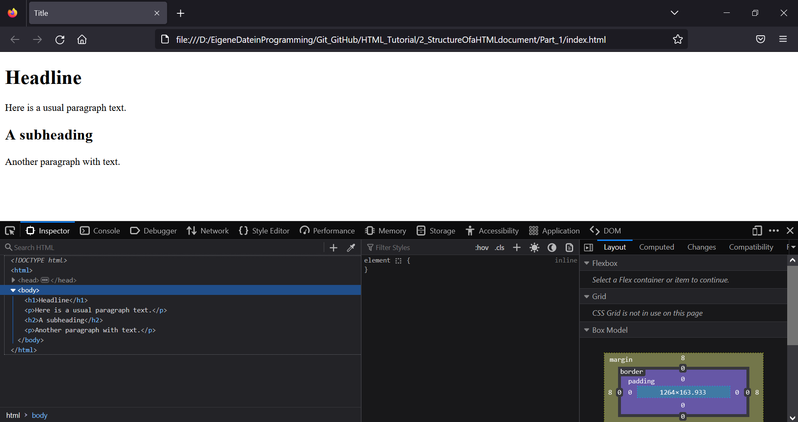
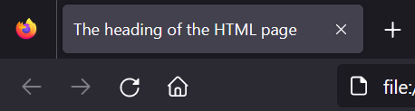

# HTML_Tutorial

 detailed tutorial about HTML + templates (all basics for HTML)

-------------------------------------------------------------------------------------------------------------

## Contents
1. Introduction to HTML
    - 1.1. Different types of websites
    - 1.2. Dynamic and static websites
    - 1.3. Programming languages for web development 
    - 1.4. Software for the creation and presentation of web pages
    - 1.5. Create and view a simple web page
2. Structure of a HTML document
    - 2.1. Syntax and structure of HTML documents
    - 2.2. Basic structure of a simple HTML document
3. The header data of an HTML document
    - 3.1. The HTML elements for the header
    - 3.2. The title element
    - 3.3. The base element
    - 3.4. The link element
    - 3.5. The style element
    - 3.6. The script element
    - 3.7. The meta element
4. The visible area of an HTML document
    - 4.1. The HTML elements for page structuring 
    - 4.2. The HTML elements for text structuring
    - 4.3. Semantic HTML
    - 4.4. HTML elements for text markup

-------------------------------------------------------------------------------------------------------------

## 1. Introduction to HTML

### 1.1. Different types of websites
  * **Web presence (Homepage / Corporate Website)**
    - can be a private homepage or a web presence of companies, associations, authorities or business persons
    - for companies, municipalities and non-profit organizations it is often called a corporate website
    - many small companies and private persons use ready-made systems such as *WordPress* (Content-Management-System)

  * **Blog / online magazine / portfolio**
    - a website with usually chronologically sorted entries, which are separated from each other
    - can also be the start page of a website to display the latest articles or current information
    - online magazines can also be structured in this way
    - many companies and private persons often use ready-made systems like e.g., *WordPress* or *Drupal*
    - there are different blog types e.g. *corporate blog* (official company blog), *microblogging* (Twitter)
    - the installation of a blog software (e.g. *WordPress*) is flexible, because the blog can be extended with many templates and modules
    - portfolio websites are well suited for designers, photographers, artists and creatives, often website themes with minimalistic design
    - Knowledge of PHP and MySQL is an advantage but not necessary when using e.g. [Blogger](https://www.blogger.com) or [tumblr](https://www.tumblr.com) 

  * **E-commerce websites**	
    - in practice, one uses ready-made software, since the effort is less to update or maintain production catalog, and more importantly are much more secure especially with payment transactions
    - with ready-made software, an online store can be set up quite quickly, but there is a long list of legal requirements that must be observed (imprint obligation, terms and conditions, cancellation policy, information on delivery times and prices, etc.)
    - depending on the range of functions, an online store can be expensive, from complete solutions offered by hosting providers to professional webshop software to be installed on a server or webspace
    - frequently used software: Shopify, Magento, WooCommerce or Shopware

  * **Landing page / Microsite**
    - usually consists of only one web page, e.g. to start a test phase for a product
    - the goal is to present all the elements of the product to the visitors of the website, so that they become potential customers
    - such pages are highly optimized for search engines

  * **Web platform - social networks**
    - functionality is often provided by a content management system, typical social network platforms are e.g. Facebook, MySpace or so-called Wiki software
    - in the commercial area a better customer oriented support can be achieved
    - basic idea is that the content of registered users is extended with pictures, texts or graphics etc. to offer a collection of information, as the content is created by the users a moderation is necessary to check and manage the content

  * **Web apps**
    - these are Internet applications with many interaction possibilities, such as a common desktop application
    - such applications do not necessarily have to run in a web browser
    - Advantages can be an improved use and also a faster Perfomance


### 1.2. Dynamic and static websites
  * **Static websites**
    - the complete content such as texts, image data is stored unchanged in individual files on the web server
    - the content of such a file is created with HTML
    - in case of changes, the files usually have to be changed manually on the local computer and then uploaded to the webserver again
    - worthwhile for smaller web presences, where changes are rarely necessary 

  * Advantages:
    - costs are lower because no special features (databases, scripting languages) are needed
    - page load and load time may be faster, because page can be returned immediately from the web server as an response to the request
    - Development can be easier and cheaper, but it depends on the size of the project and the knowledge of the user

  * Disadvantages:
    - good knowledge of HTML and co. necessary to update website
    - creation of many single files for static website can be very time consuming


 

 This is a simplified representation of how a static web page is returned. The web browser first sends a request for a web page to the web server that hosts the web page. The web server finds the page and sends it back to the web server as a response. If it is not found, an error message is returned (status code 404).


  * **Dynamic websites**
    - usually a CMS (Content-Management-System) generates the web pages.
    - content like text and images are usually kept separate from the technical elements like layout or scripting
    - a CMS must be installed in a web server environment to be able to use previously installed script languages like PHP or Python and usually databases like MySQL or PostgreSQL

  * Advantages:
    - updating content and adding new content can be done much more quickly via a web-based user interface.
    - design changes can be made in one central place, usually many templates are available for this purpose, the changes affect all existing web pages at the same time
    - can be maintained without HTML and other programming skills
    - can be managed by several people
    - new functionalities can be added at any time with modules/plug-ins

  * Disadvantages:
    - there are higher costs, because special features like script languages and databases are needed, but not as expensive as a few years ago
    - for creating own modules and plug-ins programming skills are necessary


 

 This is a simplified representation of how a dynamic web page is created. A web browser makes a request for a web page to a web server. The web server finds the page and passes it to the application server. The application server searches the page for commands and completes the web page. Additionally, instructions for database queries may be included. The database driver then returns the requested record to the application server, where the data is inserted into the web page. The web page is then sent as a response to the web browser.


### 1.3. Programming languages for web development
  * This is an overview of the programming language that a web developer must know.

  * **HTML** (Hypertext Markup Language)
    - is a text-based markup language for structuring electronic documents such as text with hyperlinks, images and other content. HTML documents are the basis of the World Wide Web and are displayed by web browsers. In addition to the content displayed by the browser, HTML files can contain additional details in the form of meta information, e.g. about the languages used in the text, the author or the summarized content of the text --> [W3C](https://www.w3.org/)

  
  * **CSS** (Cascading Style Sheets)
    - It is a design and formatting language used to determine the appearance of HTML documents. So it's about design or style, not the content of a web page. In practice, HTML is used only for structuring the web page, and CSS for formatting and styling. It is possible to include CSS directly in HTML. For large or more web pages it is advantageous to save this in a CSS file, then all web pages can be changed with once.

  * **JavaScript**
    - is the most important client-side scripting language, allowing to extend the limited possibilities of HTML with user interactions

  * **Server-side scripting languages and databases**
	  - common languages for dynamic websites are Python, PHP, Ruby etc., and for databases e.g. MySQL or PostgreSQL
	  - Knowledge in PHP and MySQL can be an advantage for e.g. formmails, guestbooks or surveys


### 1.4. Software for the creation and presentation of web pages
  * Basically, on every operating system there is a text editor for creating web pages and a browser for displaying the web page.
	  - Windows: Notepad
	  - Linux: e.g. gEdit
	  - Mac: TextEdit 

  * Most web developers use special editors, the advantage is on the one hand the syntax highlighting and many other helpful functions for the creation of web pages.
    - Visual Studio Code --> [VSCode](https://code.visualstudio.com/) (my favorite)
    - Adobe Brackets --> [Adobe Brackets](https://brackets.io/) 
    - Atom --> [Atom](https://atom.io/) 
    - Sublime Text --> [Sublime Text](https://www.sublimetext.com/) 
    - Notepad++ --> for beginners 

  * For the display of the HTML document you need a web browser. For testing it is best to use several web browsers, because there are small differences. You should also test the web pages on different devices, such as desktop computer, laptop, tablet and smartphone. In the best case, the display of the website adapts to the devices. This adaptability is called responsive web design. This adaptation does not happen automatically.
	  - the main web browsers currently are (largest mart share): Google Chrome, Mozilla Firefox, Safari (Apple) and Edge (Microsoft).
	  - Other web browsers (smaller market share): Vivaldi, Opera, Brave 

  * The HTML renderer (browser engine) converts the source code into a visible web page.
    
    | Renderer  | Browser                                                     |
    | --------- | ----------------------------------------------------------- |
    | Quantum   | Firefox                                                     |
    | Webkit    | Safari and all web browsers on iOS                          |
    | Blink     | Chrome, Edge, Samsung Internet, Vivaldi, Opera, Brave etc.  |


### 1.5. Create and view a simple web page
  1. open an editor (for the beginning a simple editor is enough), and create a new empty document.
  2. enter HTML code into the editor, example --> *1_IntroductionToHTML/Part_1/index.html*
  3. save HTML code, it is recommended to create a new directory for it. When saving the file, make sure that the file is saved with the file extension *.html*. As encoding *UTF-8* is always good, you can also use *ANSI* for the time being.
  4. The HTML file can now be opened with a browser, usually it is enough to double-click the file and the standard browser opens and displays the file.

 * **Check HTML-Code**.
   - Whether the HTML code or the web page is correct, you can check it, with the online tool  at W3C [Validator](http://validator.w3.org) you can validate the code (in many editors such a function is available or can be integrated later)
   - if the code is error free a green bar is displayed (W3C)
   - If the validation is invalid, the error is listed with a message. An error output does not mean that the web page cannot be displayed, because the web browsers are relatively error tolerant, but it can lead to errors.
   - Many large websites have errors, hardly any site is 100% error free.

 * Advantages to validate the HTML code:
   - the correct display in all browsers, the browsers are relatively error-tolerant but there are differences, especially with mobile devices you should pay attention to it
   - Search engines look for texts and keywords, so that it can be found more easily
   - Accessible websites, incorrect text or structure can cause assistive tools such as read aloud software to not work properly.
   - helpful for beginners to recognize errors quickly and prevents writing unclean code --> a clean code shows quality

-------------------------------------------------------------------------------------------------------------

## 2. Structure of a HTML document

### 2.1. Syntax and structure of HTML documents
* The HTML document is very structured. A complete *HTML element* usually consists of an opening HTML tag (**\<html>**), a closing HTML tag (**\</html>**) and everything in between. As *HTML- element* is usually called everything that stands between the tags. So the *HTML elements* ("headline") are marked by *HTML tags* (**\<h1>** and **\</h1>**).

  - everything between **\<html>** and **\</html>** (root element) is the HTML code for the HTML document
  - between **\<head>** and **\</head>** the header data of the HTML document is summarized
  - the part visible in the web browser is between **\<body>** and **\</body>**
  - between **\<h1>** and **\</h1>** is a 1st order heading
  - between **\<h2>** and **\</h2>** there is a 2nd order heading
  - between **\<p>** and **\</p>** there is a normal paragraph

  - example --> *2_StructureOfaHTMLdocument/Part_1/index.html*
   ```
    <!doctype html>
    <html>
      <head>
        <meta charset="UTF-8">
        <title>Title</title>
      </head>
      <body>
        <h1>Headline</h1>
        <p>Here is a usual paragraph text.</p>
        <h2>A subheading</h2>
        <p>Another paragraph with text.</p>
      </body>
    </html>
   ```

* The HTML code of an HTML document consists of pure text. A web browser creates a model from this in the form of a tree structure of objects such as HTML elements, attributes, and texts. This is called a **Document Object Model (DOM)**. Each object in it is called a **node** and can be manipulated via a public interface using JavaScript. This DOM tree can be viewed in the browser, using developer tools provided by the browser.





* Most HTML elements can be nested and contain other HTML elements, creating a hierarchical structure.
  - Here, within the paragraph, the b element has been nested (b = bold). **b** is the child element of **p** and **p** is the child element of **body**. **html** is the parent element of **body**. In this example, **b** is the child-child-child element of **html**.
  - Complex HTML documents contain a lot of nesting.
  - It is important to avoid incorrect nesting, otherwise the web page can be displayed incorrectly and it becomes very confusing.
  - example --> *2_StructureOfaHTMLdocument/Part_2/index.html*

   ```
    <!doctype html>
    <html>
      <head>
        <meta charset="UTF-8">
        <title>Title</title>
      </head>
      <body>
        <p>Here is an <b>usual</b> paragraph text.</p>
    </body>
  </html>
   ```


* Some HTML elements are standalone tags (void tags) that have no content e.g. **\<br>** (which creates a line break), but this should not be abused, to increase the spacing between lines use CSS.

* HTML elements can contain additional attributes (properties). These can be used to specify additional information about an element. Attributes can be used only with start tags.
  - with the attribute **lang="en"** you specify the language that will be used
  - the **\<a></a>** element defines a hyperlink to another page, at **href** you specify the URL to navigate to 
  - the standalone tag **\** can be used to display images, **src** specifies the location of the image, alt specifies the alternative text if the image cannot be displayed
  - example --> *2_StructureOfaHTMLdocument/Part_3/index.html*

   ```
    <!doctype html>
    <html>
      <head>
        <meta charset="UTF-8">
        <title>Title</title>
      </head>
      <body>
        <p lang="en">   <!-- lang = language -->
          Please <a href="https://www.google.com/">click</a> here
        </p>
        <p>
          
        </p>
      </body>
    </html>
   ```


* There is the possibility to leave comments within the HTML document, these are helpful to understand the code later, if you forget something. Comments are not visible on the web page in the browser but in the source code, which everyone can see.
  - this is how a comment is created, everything between the characters is the comment and is not visible on the web page:
   ```
    <!-- comment --> 
   ```


### 2.2. Basic structure of a simple HTML document

   ```
    <!doctype html>
    <html>
      <head>
        <meta charset="UTF-8">
        <title>Title</title>
      </head>
      <body>
        <!-- Visible area of the web page in the browser -->
    </body>
  </html>
   ```


* \<!doctype html>
  - is the first specification in an HTML document, and not an HTML tag but an instruction
  - it is an instruction for the web browser, in which HTML version the web page was created 

* \<html> \</html>
  - informs the web browser that there is HTML code present
  - it encloses all other elements in the HTML code (except \<!doctype html>)
  - there you can also specify the language **lang="en "** (very helpful for accessibility)

* \<head> \</head>
  - here information is given which is evaluated by the web browser and search engines e.g. scripts, stylesheets, meta information with information about the HTML document.  
  - the **\<title> \</title>** specifies only the title of the web page that can be seen in the browser

* \<body> \</body>
  - the body element is the displayable area of an HTML document
  - everything contained in it, such as texts, images, hyperlinks or tables is displayed in the browser


-------------------------------------------------------------------------------------------------------------


## 3. The header data of an HTML document
### 3.1. The HTML elements for the header
* Between \<head> and \</head> different HTML elements can be inserted, with which the contents and the representation can be controlled. Relationships between the web browser and other pages or documents can also be established there. The content in the header (except **title**) is not displayed in the browser. The **head** element must follow directly after the open **html** element. The only specification in the **head** area that should always be made is the **title** element.. 


| HTML element           | Explanation                                                                     |
|----------------------- | ------------------------------------------------------------------------------- |
| \<title>...</title>    | the title of the HTML document (visible in the browser)                         |
| \<base>                | sets base URLs / targets for all relative URLs in a web page                    |
| \<link>                | sets logical links of the HTML document to other files to be included           |
| \<style>...\</style>   | sets the local stylesheet rules for the HTML document                           |
| \<script>...\<script>  | includes the client-side scripts, may also be used outside the **head** element |
| \<meta>                | sets the metadata like keywords, descriptions or the character set for the HTML document     |
---

     ```
      <!doctype html>
      <html>
        <head>
          <base href="https://www.website.com/" target="_blank">
          <link rel="stylesheet" href="style.css">
          <link rel="stylesheet" href="https://cdnjs.cloudflare.com/ajax/libs/font-awesome/4.7.0/css/font-awesome.min.css">
          <style>
            body {background-color: green;}
          </style>
          <script src="ajax_libs_jquery_3.5.js"></script>
          <meta name="keywords" content="HTML, CSS">
          <meta name="description" content="Free Web tutorials for HTML">
          <meta charset="UTF-8">
          <meta http-equiv="X-UA-Compatible" content="IE=edge" />
          <meta name="viewport" content="width=device-width, initial-scale=1.0" />
          <title>Website title</title>
        </head>
        <body>
          <!-- Visible area of the web page in the browser -->
        </body>
      </html>
     ```
The complete explanations for each tag will be given in the next chapters, these are just examples, at this point you don't need to understand it all.


### 3.2. The title element 
 * A title should be used in each HTML document, which is displayed in the browser header. Only one title element can be used per HTML document. The title element can be skipped, but the web page will not be considered valid. The title element serves the user e.g. if the page is saved as a bookmark, then the title is displayed as a name suggestion. And most importantly, the title has a high importance in search engines, because it is what the user sees first in the search engine when the pages are listed. 

   ```
    <head>
      <meta charset="UTF-8">
      <title>The heading of the HTML page</title>
    </head>
   ```
- example --> *3_TheHeader/Part_1/index.html*




### 3.3. The base element
 * The base-element specifies a base URL or base target for all relative URLs in an HTML document. By defining such a base URL, a relative or absolute address to the file can be used in the document as if it were located directly on the same host or computer. Can be used only once in the HTML document.
   - example --> *3_TheHeader/Part_2/index.html*

    ```
     <head>
       <base href="https://www.w3schools.com/" target="_blank">
     </head>
    ```
   source [w3school](https://www.w3schools.com/tags/tag_base.asp)

| Attributes | Explanation                                                                                     |
| ---------- | ----------------------------------------------------------------------------------------------- |
| **href**   | The base URL is defined in the process. This URL is used by the web browser as the base address for relative and absolute path specifications in the document and is supplemented with this base URL.         |
| **target** | This attribute is used to specify the target window in which the link target should be displayed. Possible values and their meaning are:                                                                        |
| _self  | opens the link in the current window, is the default setting when *target* is not used             |
| _blank | opens the link in a new window or tab                                                              |
| _parent| opens the reference in the parent window: is the window from which the current window was opened   |
| _top   | loads the reference of the file in the highest hierarchy in the window			                        |


### 3.4. The link element
* The link element is a stand-alone tag that may be used multiple times in the HTML document. In practice, it is often used to include an external CSS file, and other files. The relationship between the HTML document and the external document is specified with the HTML attribute *rel*.
   - example --> *3_TheHeader/Part_3/index.html*

   ```
    <head>
      <title>Logical linking with link</title>
      <link rel="stylesheet" type="text/css" href="style.css">
      <meta charset="UTF-8">
    </head>
   ```

| Attributes  | Explanation                                                                                     |
| ----------- | ----------------------------------------------------------------------------------------------- |
| **href**    | Here the URL to the resource to be linked is specified, this attribute must be used.     	      |
| **hreflang**| Defines the language of the resource to be linked                                               |
| **media**   | Here you specify for which medium/device the target resource is optimized in *href*.            |
| **size**    | Specifies the size for the resource to be linked, e.g. *rel="icon" size="any "*.                |
| **type**    | This specifies the *MIME type* for the document to be linked e.g. *type="text/css "*.    	      |
| **rel**     | This sets the relationship between the current document and the external resource in *href*. Possible values are: |
| alternate | links to an alternative presentation form of the current page 		       				       |
| author    | links to another page with information about the author    		      				           |
| mailto    | link to an e-mail address of the author                               	 	       			 |
| archives  | links to a previous version of certain documents           		       				           |
| help      | links to a help document                                      		       				       |
| icon      | this assigns a favicon to the web page                                                 |
| license   | links the current page, with the page of the rights of use for the contents of the page|
| next,pref | is used to create a link from the current or previous page      	                     |
| prefetch  | links to an external web page that the user is likely to visit next       				     |
| pingback  | the website of a pingback server is specified here							                       |
| search    | links the current document to another document where the search is possible through the whole web page 	|
| stylesheet| links an external CSS file to the current HTML document							                   |
| tag       | a simple tag as a linked resource that applies to the current document					       |


### 3.5. The style element
* This element can be used to include style information (CSS) within the HTML document.
   - example --> *3_TheHeader/Part_4/index.html*

   ```
    <head>
      <style type="text/css">
       p { 
          width: 200px;
          padding: 10px;
          border: 5px solid green;
          background-color :greenyellow;
          text-align: center;
        }
      </style>
      <title>The style element in action</title>
      <meta charset="UTF-8">
    </head>
   ```
| Attributes  | Explanation                                                                                    |
| ----------- | -----------------------------------------------------------------------------------------------|
| **media**   | Here you specify for which medium/device the target resource is optimized in *href*.           |
| **type**    | This specifies the *MIME type* for the document to be linked e.g. *type="text/css "*.    	     |


### 3.6. The script element
* This element is used to include scripts in a document. The script can either be included directly in the HTML document between \<script>...</script>, or an external script with the src attribute.
   - example --> *3_TheHeader/Part_5/indexA.html* 

   ```
    <head>
      <title>Use the script element</title>
      <script type="text/javascript">
 
         window.onload=alert("JavaScript!")

      </script>
      <meta charset="UTF-8">
    </head>
   ```

   - example --> *3_TheHeader/Part_5/indexB.html* --> external script

   ```
    <head>
      <title>Use the script element</title>
      <script type="text/javascript" src="script.js"></script>
      <meta charset="UTF-8">
    </head>
   ```


| Attributes  | Explanation                                                                                |
| ----------- | ------------------------------------------------------------------------------------------ |
| async       | the script is executed asynchronously with the HTML document, can only be used for external scripts |
| charset     | lsets the character encoding for the external script			 				|
| defer       | the web page is parsed first and then the script is executed, can only be used for external scripts |
| src         | this specifies the URL to the external script								|
| type        | this specifies the *MIME type* for the document to be linked e.g. *type="text/javascript"*.   |


### 3.7. The meta element
* This can be used to record additional information or data about the HTML document. This can be instructions for the web browser, the web server or a web crawler. This information is optional but often included. There are many such attributes, and many of these are not uniformly standardized. A meta element usually consists of two attributes (*http-equiv, name/content*).
   ```
    <meta http-equiv="refresh" content="5">
   ```

* The most used meta tags
  - The HTML attribute *name* can contain any amount of information in the *content*. But some default metadata for *name* has been defined. The *name/content* combination is not meant for personal information, but about the HTML document. The *keyword* is important for search engines. 
     ```
      <head>
        <meta name="author" content="John Doe">
        <meta name="keywords" content="HTML, meta data">
      </head>
     ```
 
  - The *http-equiv* specification is for the web browser to communicate with, but web servers don't actually parse HTML documents, so it's up to the browser who processes the specification.
  - example --> *3_TheHeader/Part_6/indexA.html* 
     ```
      <head>
        <meta http-equiv="refresh" content="5">
      </head>
     ```
  - This specification should be used if the web page was not created in English to be able to display special characters.
  - example --> *3_TheHeader/Part_6/indexB.html* 
     ```
      <head>
        <meta charset="UTF-8">
      </head>
     ```

* The viewport
  - is the area of the browser window in which the webinahlte are displayed. In order for the web page to be displayed properly on a mobile device, we need this specification (responsive web design)
	- initial-scale=1.0* ensures that the browser displays the page with the normal zoom level.
     ```
      <head>
        <meta name="viewport" content="width-device-width" initial-scale=1.0 >
      </head>
     ```

* Webcrawler
  - This allows the search robot to include the web page in the search engine index and follow the hyperlink. However, it can be omitted because that is the usual behavior of a web crawler. 
     ```
      <head>
        <meta name="robots" content="index,follow">
      </head>
     ```

  - This specifies the web page should not be included in the search engine index area. 
     ```
      <head>
        <meta name="robots" content="noindex">
      </head>
     ```

* Helpful metadata for search engines
	- For search engines *name* values have special meaning *keywords* and *description*. However, *keywords* has not so great importance anymore, in addition much abuse and the search engines the complete side after contents examines. *keywords* should still be specified because if the page is found, the search engine displays this text, if no specification of *keywords* then the search engine looks for any text of the page.
     ```
      <head>
        <meta name="keywords" content="html, meta, tutorial">
      </head>
     ```

* These meta data should be present in a HTML framework
	- finally it is up to everyone which are needed, these should at least be included

     ```
      <head>
        <meta charset="UTF-8">
        <meta name="description" content="A description should be as short and precise as possible. 
        It should explain in 2-3 sentences what this page is about.">
        <meta name="viewport" content="width-device-width" initial-scale=1.0 >       
      </head>
     ``` 

* The HTML attributes for the HTML element \<meta>

| Attributes | Explanation                                                                                    |
| ---------- | -----------------------------------------------------------------------------------------------|
| content    | passes the value associated with the attribute of *http-equiv* or *name*					              |
| charset    | sets the character encoding for the HTML document				 						                          |
| http-equiv | is used for the HTTP response header. Some possible values are: content-language, content-type, default-style, refresh	|
| name       | defines a name for the metadata. Some default values are: application-name, author, description, generator, keywords	|


-------------------------------------------------------------------------------------------------------------


## 4. The visible area of an HTML document
### 4.1. The HTML elements for page structuring
* These elements are needed to divide the web page into meaningful areas. The content model was introduced to combat the rampant use of *div* elements with *class* attributes.

| HTML elements | Explanation                                                                            |
| ------------- | -------------------------------------------------------------------------------------- |
| \<body>       | displayable area of the HTML document, visible on the web page 						 |
| \<section>    | divides the HTML document into different sections				 					         |
| \<article>    | subdivision of content into a self-contained topic-specific block		       |
| \<aside>      | used for marginal information of a content like a sidebar or additional information about an article  |
| \<nav>        | elements used to mark up navigation such as a sitemap or the main navigation of a web page				  |
| \<h1> - \<h6>  | headings of the 1st - 6th order												                    |
| \<header>     | header of a content													                              |
| \<footer>     | footer of a content													                              |	
| \<address>    | contact information about the author of the content											  |

* \<body>
	- everything between \<body> and \</body>, is called the document body
	- all HTML elements such as text, hyperlinks, images, tables or lists are displayed there to define the structure of the web page
	- all elements in the document body are rendered by the web browser and displayed accordingly

* \<section>
	- this element is initially used only to divide the content into semantic sections
	- mainly serve to give meaning to the content, especially helpful for developers, search engines and screen readers
	- the content is divided into topic-related sections, helpful when creating individual chapters or subchapters 
  - example --> *4_TheBody/Part_1/index.html* 
     ```
      <body>
        <section>
        <h1>Chapter 1</h1>
        <p>The first chapter</p>
        </section>
        <section>
          <h1>Chapter 2</h1>
          <p>The second chapter</p>
          <section>
            <h2>Chapter 2.1</h2>
            <p>A subchapter of chapter 2</p>
          </section>
        </section>
      </body>
     ```

* \<article>
	- should be used to summarize content in a self-contained topic-specific block
	- is relatively similar to \<section>, however \<article> should be used for self-contained sections, such as news item
  - example --> *4_TheBody/Part_2/index.html*
     ```
      <body>
      <h1>My blog</h1>
      <p>Latest HTML reports</p>
      <article>
        <header>
          <h2>HTML5.3</h2>
        </header>
        <p>Published on <time>2018-05-05</time></p>
        <footer>
          <a href="comments.html">Show comments...</a>
        </footer>
      </article>
      </body>
     ```

* \<aside>
	- can usually supplement or extend content with additional information
	- can be used either for a sidebar or additional information (e.g. citation) within an \<article> element
  - example --> *4_TheBody/Part_3/indexB.html*
  - example --> *4_TheBody/Part_3/indexA.html*
     ```
      <body>
      <h1>My blog</h1>
      <p>Latest HTML reports</p>
      <article>
        <header>
          <h2>HTML5.3</h2>
        </header>
        <p>Published on <time>2018-05-05</time></p>
        <p>As already suspected ...</p>
        <footer>
          <a href="comments.html">Show comments...</a>
        </footer>
      </article>
      <aside>
      <h3>Partner websites</h3>
        <ul>
          <li><a href="#">Blog XY</a></li>
          <li><a href="#">Magazin X</a></li>
         <li><a href="#">Website Z</a></li>
        </ul>
      </aside>
      </body>
     ```

* \<nav>
	- this can be used to split navigation elements into blocks e.g. for the main navigation or a list of links for a sitemap
	- should be used when whole blocks of links are needed
  - example --> *4_TheBody/Part_4/index.html*
     ```
      <body>
      <nav>
        <a href="#">Blog</a> |
        <a href="#">Links</a> |
        <a href="#">About me</a> |
        <a href="#">Legal Notice</a>
      </nav>
      <h1>My blog</h1>
      <p>Latest HTML reports</p>
      <article>
        <header>
          <h2>HTML5.3</h2>
        </header>
        <p>Published on <time>2018-05-05</time></p>
        <p>As already suspected ...</p>
        <aside>
        <h3>Related articles</h3>
          <nav>
          <ul>
            <li><a href="#">HTML5.4 will not exist</a></li>
            <li><a href="#">W3C and WHATWG disagree</a></li>
            <li><a href="#">What comes after HTML5?</a></li>
          </ul>
          </nav>
        </aside>
        <footer>
          <a href="comments.html">Show comments...</a>
        </footer>
      </article>
      <aside>
      <h3>Sitemap</h3>
        <nav>
        <ul>
          <li><a href="#">Blog</a>
          <ul>
            <li><a href="#">HTML</a></li>
            <li><a href="#">CSS</a></li>
          </ul>
          </li>
          <li><a href="#">Links</a></li>
          <li><a href="#">About me</a>
          <ul>
            <li><a href="#">Vita</a></li>
            <li><a href="#">Portfolio</a></li>
          </ul>
          </li>
          <li><a href="#">Legal Notic</a></li>
        </ul>
        </nav>
      </aside>
      </body>
     ```

* \<h1> - \<h6>
	- is used for headings, this element is used to define the content structure of a document
  - example --> *4_TheBody/Part_5/indexA.html*
     ```
      <body>
      <h1>My blog</h1>
      <p>A simple blog...</p>
        <h2>HTML News</h2>
          <h3>A preview of HTML5.3</h3>
          <p>It looks like it ...</p>
        <h2>CSS News</h2>
          <h3>New styles</h3>
          <p>After a long period of development ...</p>
      </body>
     ```
  - Outline: is the name for the structure of the document
	 - [HTML5 Outliner](https://h5o.github.io) 
	 - [Validation check](https://validator.w3.org/nu/#textarea)
	 - example --> *4_TheBody/Part_5/indexB.html*

* \<header> and \<footer>
	- is responsible for the header and footer of an HTML document
	- in the \<header> can be other elements, but to nest another \<header> in it is not optimal, but can be used several times in the document, the \<header> does not have to be the first element 
	- \<footer> does not have to be the last element in the document, it usually contains legal information, legal notice, contact information, no other element can be used inside the \<footer>
  - example --> *4_TheBody/Part_6/index.html*
     ```
      <body>
      <header>
        <hr />
        <small>Blog version 1.0</small>
        <h1>My blog</h1>
        <p>A simple blog...</p>
        <hr />
      </header>
      <h2>HTML News</h2>
      <article>
        <h3>New HTML elements</h3>
        <p>It looks like ...</p>
      </article>
      <footer>
        <hr />
        <a href="#">Information</a> |
        <a href="#">Legal Notice</a> |
        <a href="#">Contact</a> |
        <a href="#">About me</a>    <hr />
      </footer>
      </body>
     ```

* \<address> 
	- should be used exclusively for contact information about the author, it is best to use it in the \<footer> element
  - example --> *4_TheBody/Part_7/index.html*
     ```
      <body>
      <header>
        <hr />
        <small>Blog version 1.0</small>
        <h1>My blog</h1>
        <p>A simple blog...</p>
        <hr />
      </header>
      <h2>HTML News</h2>
      <article>
        <h3>New HTML elements</h3>
        <p>It looks like ...</p>
	      <footer>
          <address>The article was created by:<br>
            Rick Sample<br>
            Samplestreet 1234<br>
            12345 Sampletown<br>
		        www.website.com
          </address>
        </footer>
      </article>
      <footer>
        <hr />
        <a href="#">Information</a> |
        <a href="#">Legal Notice</a> |
        <a href="#">Contact</a> |
        <a href="#">About me</a>    <hr />
      </footer>
      </body>
     ```

### 4.2. The HTML elements for text structuring 
* These elements are used to structure plain text content. 

| HTML elements | Explanation                                             |
| ------------- | ------------------------------------------------------- |
| \<p>          | Text paragraph 								                          |
| \<br>         | Line break 								                              |
| \<wbr>        | optional line break within a word 			                |
| \<hr>         | thematic separation at the paragraph level 				      |
| \<blockquote> | Quote in the form of a text paragraph 					        |
| \<div>        | Define a general area 					                        |
| \<main>       | should be used for a main content area of a web page    |
| \<figure>     | group or combine content for separate description       |
| \<figcaption> | labeling content grouped with the *figure* element      |
| \<ul>         | unordered bulleted list 						                    |
| \<ol>         | ordered list (usually numbered) 					              |
| \<li>         | a list element in an *ul* or *ol* list 				          |
| \<dl>         | a description list with *dt* and *dd* elements 			    |
| \<dt>         | the expression to describe before the *dd* element 			|
| \<dd>         | the description that follows after the *dt* element 	  |


* \<p>
	- is used with text paragraphs, everything written between \<p> and \</p> is treated as a text paragraph
	- images, videoss or audios or other text markup can also be used within them
	- cannot be used within the *p elements* other group elements, headings or section elements.
  - example --> *4_TheBody/Part_8/index.html*
     ```
      <h2>HTML News</h2>
      <article>
          <h3>New HTML elements</h3>
          <p>Lorem ipsum dolor sit amet, consectetuer adipiscing elit. Aenean commodo ligula eget dolor. Aenean massa. Cum sociis natoque penatibus et magnis dis parturient montes, nascetur ridiculus mus. Donec quam felis, ultricies nec, pellentesque eu, pretium quis, sem. Nulla consequat massa quis enim. Donec pede justo, fringilla vel, aliquet nec, vulputate eget, arcu. In enim justo, rhoncus ut, imperdiet a, venenatis vitae, justo. </p>
          <p>Nullam dictum felis eu pede mollis pretium. Integer tincidunt. Cras dapibus. Vivamus elementum semper nisi. Aenean vulputate eleifend tellus. Aenean leo ligula, porttitor eu, consequat vitae, eleifend ac, enim. Aliquam lorem ante, dapibus in, viverra quis, feugiat a, tellus. </p>
      </article>
     ```

* \<br>
  - is needed to force a line break 
  - example --> *4_TheBody/Part_9/index.html* 
     ```
      <address>
      Rick Sample<br>
      Sampletown<br>
      www.address.com    
      </address>
     ```

* \<wbr>
  - is needed to force an optional line break e.g. for an optimal display in the web browser
     ```
      <p>To learn AJAX, you must be familiar with the XML<wbr>Http<wbr>Request Object.</p>
     ``` 
- A commonly used entity in HTML is the non-breaking space: \&nbsp;. A non-breaking space is a space that will not break into a new line. Two words separated by a non-breaking space will stick together (not break into a new line). This is handy when breaking the words might be disruptive.
     ```
       <p>word1&nbsp;&nbsp;&nbsp;word2</p>
     ```

* \<hr>
	- this creates a thematic separation, e.g. to separate a content more clearly from each other 
  - example --> *4_TheBody/Part_10/index.html* 
     ```
      <article>
        <h3>New HTML elements</h3>
        <p>Lorem ipsum dolor sit amet, consectetuer adipiscing elit. Aenean commodo ligula eget dolor. Aenean massa. Cum sociis natoque penatibus et magnis dis parturient montes, nascetur ridiculus mus. Donec quam felis, ultricies nec, pellentesque eu, pretiumquis, sem. Nulla consequat massa quis enim. Donec pede justo, fringilla vel, aliquet nec, vulputate eget, arcu. In enim justo, rhoncus ut, imperdiet a, venenatis vitae, justo. </p>
        <hr />
      </article>
      <article>
        <h3>Finally implemented</h3>
        <p>Nullam dictum felis eu pede mollis pretium. Integer tincidunt. Cras dapibus. Vivamus elementum semper nisi. Aenean vulputate eleifend tellus. Aenean leo ligula, porttitor eu, consequat vitae, eleifend ac, enim. Aliquam lorem ante, dapibus in,viverra quis, feugiat a, tellus. </p>
        <hr />
      </article>
     ```

* \<blockquote>
  - here usually a text is quoted from another source.
  - the \<blockquote> contains a **cite** attribute, this indicates the source of the quote, but unfortunately it is not yet visible in the web browser and therefore the source should be added to the web page additionally
  - example --> *4_TheBody/Part_11/index.html*

     ```
      <article>
          <h3>New HTML elements</h3>
          <p>Lorem ipsum dolor sit amet, <q>consectetuer adipiscing</q> elit. Aenean commodo ligula eget dolor. Aenean massa. Cum sociis natoque penatibus et magnis dis parturient montes, nascetur ridiculus mus. Donec quam felis, ultricies nec, pellentesque
              eu, pretium quis, sem. Nulla consequat massa quis enim. Donec pede justo, fringilla vel, aliquet nec, vulputate eget, arcu. In enim justo, rhoncus ut, imperdiet a, venenatis vitae, justo. </p>
          <blockquote cite="https://www.blindtextgenerator.com/">
              Nulla consequat massa quis enim. Donec pede justo, fringilla vel, aliquet nec, vulputate eget, arcu. In enim justo, rhoncus ut, imperdiet a, venenatis vitae, justo.
              <small> - https://www.blindtextgenerator.com/ - </small>
          </blockquote>
      </article>
     ```

* \<div>
  - here a general area is defined, this causes first only a new line
  - it has real meaning only with CSS to define layout areas
  - the div element should only be used if there is no suitable HTML element, it is better to use semantic HTML e.g. header, nav, section, article, footer
  - can be used several times in the document
  - example --> *4_TheBody/Part_12/indexB.html*
  - example --> *4_TheBody/Part_12/indexA.html*
     ```
      <body>
          <div class="header">
              <hr />
              <h1>My blog</h1>
              <p>A simple blog...</p>
              <hr />
          </div>
          <h2>HTML News</h2>
          <div class="article">
              <h3>New HTML elements</h3>
              <p>Lorem ipsum dolor sit amet, consectetuer adipiscing elit. Aenean commodo ligula eget dolor. Aenean massa. Cum sociis natoque penatibus et magnis dis parturient montes, nascetur ridiculus mus. Donec quam felis, ultricies nec, pellentesque eu, pretium
                  quis, sem. Nulla consequat massa quis enim. Donec pede justo, fringilla vel, aliquet nec, vulputate eget, arcu. In enim justo, rhoncus ut, imperdiet a, venenatis vitae, justo. </p>
          </div>
          <div class="footer">
              <hr />
              <a href="#">Information</a> |
              <a href="#">Legal Notice</a> |
              <a href="#">Contact</a> |
              <a href="#">About me</a>
              <hr />
          </div>
      </body>
     ```

* \<main>
  - is used in practice for the main content of a web page, should not be used within section, article elements etc.
  - usually behaves like a div element, but should be used only once in the document
  - is not a section element (\<section>) but a pure grouping element
  - example --> *4_TheBody/Part_13/index.html*
     ```
      <body>
      <header>
        <h1>My blog</h1>
        <p>A simple blog...</p>
      </header>
      <main>
        <h2>HTML News</h2>
        <article>
          <h3>HTML5.3</h3>
          <p>Lorem ipsum dolor sit amet, consectetuer adipiscing elit. Aenean commodo ligula eget dolor. Aenean massa. Cum sociis natoque penatibus et magnis dis parturient montes, nascetur ridiculus mus. Donec quam felis, ultricies nec, pellentesque eu, pretium quis, sem. Nulla consequat massa quis enim. Donec pede justo, fringilla vel, aliquet nec, vulputate eget, arcu. In enim justo, rhoncus ut, imperdiet a, venenatis vitae, justo. </p>
        </article>
      </main>
      <footer>
        <a href="#">Information</a> |
        <a href="#">Legal Notice</a> |
        <a href="#">Contact</a> |
        <a href="#">About me</a>
      </footer>
      </body>
     ```

* \<figure> and \<figcaption>
	- the **figure** element is used when content such as images, text, lists, tables or other HTML elements should stand out from the usual continuous text
	- for an additional optional caption **figcaption** is used
  - example --> *4_TheBody/Part_14/index.html*
     ```
      <article>
          <h3>figure and figcaption in use</h3>
          <p>The text before figure...</p>
          <figure>
              
              <figcaption>Figure 1: Once upon a time ...</figcaption>
          </figure>
          <p>The text according to figure</p>
      </article>
     ```

* \<ul> and \<li>
  - an unordered list in which all entries are marked with a bullet point
  - Web browsers usually display these bullets with bullet points 
  - lists can be nested
  - example --> *4_TheBody/Part_15/index.html*
     ```
        <article>
            <h2>Unordered bulleted list with ul</h2>
            <ul>
                <li>Lorem ipsum dolor sit amet</li>
                <li>Donec quam felis ultricies</li>
                <li>Nulla consequat massa quis </li>
                <li>Etiam ultricies nisi vel</li>
                <li>Donec vitae sapien ut libero</li>
            </ul>
        </article>
     ```

* \<ol> and \<li>
  - \<ol> is needed for ordered lists
  - they are numbered lists, in which the individual \<li> - elements are automaitsch numbered
  - lists can be nested
  - example --> *4_TheBody/Part_15/index.html*
     ```
        <article>
            <h2>Numbered enumeration list with ol</h2>
            <ol>
                <li>Lorem ipsum dolor sit amet</li>
                <li>Donec quam felis ultricies</li>
                <li>Nulla consequat massa quis </li>
                <li>Etiam ultricies nisi vel</li>
                <li>Donec vitae sapien ut libero</li>
            </ol>
        </article>
     ```
  - it is possible to reverse the numbering with HTML attribute **reversed**, then the numbering will be displayed in descending order
  - example --> *4_TheBody/Part_15/index.html* 
     ```
        <article>
            <h2>Invert numbered enumeration list</h2>
            <ol reversed="reversed">
                <li>Lorem ipsum dolor sit amet</li>
                <li>Donec quam felis ultricies</li>
                <li>Nulla consequat massa quis </li>
                <li>Etiam ultricies nisi vel</li>
                <li>Donec vitae sapien ut libero</li>
            </ol>
        </article>
     ```
  - with the HTML attribute **start** the start value of the first \<li> element, the following numberings are increased by 1
  - within the \<li> element it is also possible with the HTML attribute **value**
  - example --> *4_TheBody/Part_15/index.html* 
     ```
        <article>
            <h2>Change enumeration list numbering</h2>
            <ol start="20">
                <li>Lorem ipsum dolor sit amet</li>
                <li>Donec quam felis ultricies</li>
                <li>Nulla consequat massa quis </li>
                <li value="101">Etiam ultricies nisi vel</li>
                <li>Donec vitae sapien ut libero</li>
            </ol>
        </article>
     ```

* \<dl>, \<dt>, \<dd>
  - with this, description lists are created
  - often used for glossaries, listing of special metadata and values
  - example --> *4_TheBody/Part_15/index.html* 
     ```
        <article>
            <h2>Description lists with dl, dt and dd</h2>
            <h3>List of abbreviations</h3>
            <dl>
                <dt>4U</dt>
                <dd>For you</dd>
                <dt>ACK</dt>
                <dd>Acknowledgment</dd>
                <dt>ASAP</dt>
                <dd>As soon as possible</dd>
                <dt>FYI</dt>
                <dd>For your information</dd>
            </dl>
        </article>
     ```

### 4.3. Semantic HTML
  - semantic web pages help search engines (Google prefers semantic web pages)
  - with \<div> it is possible to create semantic web pages, but it is not standardtized structuring (due to different IDs and class names)
  - the div - element can still be used but only if no semantic element (header, nav, section etc.) fits
  - e.g. the screenreader does not recognize by the ID whether it is a navigation bar on the web page with \<div id="nav"> but only so \<nav> 

#### HTML document without precise structure
  - example --> *4_TheBody/Part_16/index.html* 
     ```
      <body>
      <h1>My blog</h1>
      <p>A blog about web development ...</p>
      <p>Navigation: 
        <a href="#">Blog</a> |
        <a href="#">Information</a> |
        <a href="#">Contact</a> |
        <a href="#">About me</a>
      </p>
      <h2>Old posts</h2>
      <ul>
        <li><a href="#">Last Week</a></li>
        <li><a href="#">Archive</a></li>
      </ul>
      <h2>How to structure web pages?</h2>
      <p>HTML documents are structured ...</p>
      <h3>Similar topics</h3>
      <ul>
        <li><a href="#">Styling web pages with CSS</a></li>
        <li><a href="#">Functionality with JavaScript</a></li>
      </ul>
      <p> 
        <a href="#">Information</a> |
        <a href="#">Legal Notice</a> |
        <a href="#">Contact</a> |
        <a href="#">About me</a>
      </p>
      </body>
     ```

#### Generic structuring with \<div>
  - example --> *4_TheBody/Part_17/indexB.html* 
  - example --> *4_TheBody/Part_17/indexA.html* 
     ```
      <body>
      <div>
      <h1>My blog</h1>
      <p>A blog about web development ...</p>
      </div>
      <div>
      <p>Navigation: 
        <a href="#">Blog</a> |
        <a href="#">Information</a> |
        <a href="#">Contact</a> |
        <a href="#">About me</a>
      </p>
      </div>
      <div>
      <h2>Old posts</h2>
      <ul>
        <li><a href="#">Last Week</a></li>
        <li><a href="#">Archive</a></li>
      </ul>
      </div>
      <div>
      <h2>How to structure web pages?</h2>
      <p>HTML documents are structured ...</p>
      <h3>Similar topics</h3>
      <ul>
        <li><a href="#">Styling web pages with CSS</a></li>
        <li><a href="#">Functionality with JavaScript</a></li>
      </ul>
      </div>
      <div>
      <p> 
        <a href="#">Information</a> |
        <a href="#">Legal Notice</a> |
        <a href="#">Contact</a> |
        <a href="#">About me</a>
      </p>
      </div>
      </body>
     ```

#### semantically structured web pages
  - example --> *4_TheBody/Part_18/index.html* 
     ```
      <body>
          <header>
              <h1>My blog</h1>
              <p>A blog about web development ...</p>
          </header>
          <nav>
              <p>Navigation:
                  <a href="#">Blog</a> |
                  <a href="#">Information</a> |
                  <a href="#">Contact</a> |
                  <a href="#">About me</a>
              </p>
          </nav>
          <aside>
              <h2>Old posts</h2>
              <ul>
                  <li><a href="#">Last Week</a></li>
                  <li><a href="#">Archive</a></li>
              </ul>
          </aside>
          <main>
              <article>
                  <h2>How to structure web pages?</h2>
                  <p>HTML documents are structured ...</p>
                  <h3>Similar topics</h3>
                  <ul>
                      <li><a href="#">Styling web pages with CSS</a></li>
                      <li><a href="#">Functionality with JavaScript</a></li>
                  </ul>
              </article>
          </main>
          <footer>
              <p>
                  <a href="#">Information</a> |
                  <a href="#">Legal Notice</a> |
                  <a href="#">Contact</a> |
                  <a href="#">About me</a>
              </p>
          </footer>
      </body>
     ```

### 4.4. HTML elements for text markup
* These are elements that are used within a plain text for single letters, words or parts of sentences to change them slightly visually. Even though text formatting with these elements is possible via HTML, CSS is responsible for the actual text formatting.
- example --> *4_TheBody/Part_19/index.html*

| HTML elements      | Explanation                                                              |
| ------------------ | ------------------------------------------------------------------------ |
| <abbr>             | Mark abbreviations or acronyms |
| <cite>             | Mark text as source text of a working title |
| <code>             | Mark up computer code within a paragraph of text |
| <pre>              | Mark up preformatted text. All spaces and line breaks are displayed as specified in the text |
| <kbd>              | Mark up text as keyboard input |
| <samp>             | |
| <dfn>              | |
| <var>              | |
| <bdo>        	     | |
| <bdi>         	   | |
| <em>         		   | |
| <strong>         	 | |
| <i>         		   | |
| <b>         		   | |
| <mark>         	   | |
| <q>         		   | |
| <u>         		   | |
| <s>         		   | |
| <ins>         	   | |
| <del>         	   | |
| <sub>          	   | |
| <sup>         	   | |
| <time>          	 | |
| <small>          	 | |
| <ruby>, <rp>, <rt> | |
| <span>          	 | |


